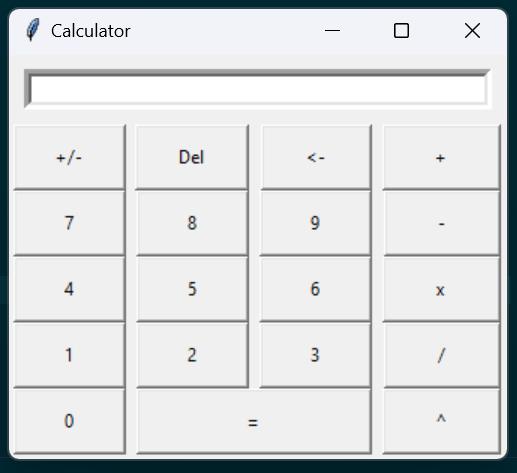

# A simple calculator

## This is a simple calculator, made using Tkinter package of python

- It only has basic functionalities at the moment:

  1. Entering numbers
  2. Addition
  3. Subtraction
  4. Multiplication
  5. Division
  6. Exponent
  7. Changing sign of the inputted number
  8. Delete all & backspace

## Current application preview

